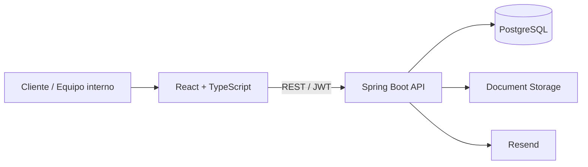

# QualityTrack

**QualityTrack** es una plataforma web para gestionar y dar trazabilidad al ciclo completo de trabajos industriales, conectando al cliente con las áreas comerciales y operativas desde la solicitud inicial hasta la entrega final.

La aplicación centraliza solicitudes, expedientes, cotizaciones, órdenes de trabajo, producción, calidad, materiales, documentos y entregas dentro de un mismo flujo.

## Demo en vivo

**Frontend**

https://qualitytrack-frontend.vercel.app/

**Backend**

https://qualitytrack.onrender.com

Desde la pantalla de acceso del frontend se puede explorar la plataforma mediante:

- **Demo cliente**
- **Demo equipo interno**

El acceso demo no expone contraseñas en el frontend. La sesión se resuelve de forma segura desde el backend.

---

## El problema

En un proceso industrial, la información suele quedar repartida entre correos, documentos, hojas de cálculo y distintas áreas de trabajo.

Eso vuelve difícil responder preguntas simples:

- ¿qué solicitó exactamente el cliente?
- ¿qué documentos pertenecen a ese trabajo?
- ¿qué cotización fue aprobada?
- ¿qué material se definió?
- ¿qué operaciones faltan?
- ¿el producto ya pasó calidad?
- ¿qué ocurrió antes de una entrega?
- ¿quién realizó cada acción?

QualityTrack reúne ese recorrido dentro de un único expediente trazable.

---

## Flujo de negocio

```text
Solicitud
   │
   ▼
Expediente / Revisión
   │
   ▼
Cotización
   │
   ▼
Orden de trabajo
   │
   ▼
Preparación + Materiales
   │
   ▼
Hoja de ruta
   │
   ▼
Producción
   │
   ▼
Calidad
   │
   ▼
Entrega
   │
   ▼
Trazabilidad completa
```

El flujo conecta dos experiencias distintas pero relacionadas.

### Cliente

El cliente puede:

- registrarse y verificar su cuenta;
- crear o ingresar a una empresa;
- administrar miembros;
- registrar direcciones;
- crear solicitudes;
- adjuntar documentos;
- seguir el estado de sus trabajos;
- revisar cotizaciones;
- aprobar, rechazar o solicitar ajustes;
- consultar el avance hasta la entrega.

### Equipo interno

El equipo interno puede:

- revisar expedientes;
- solicitar aclaraciones;
- preparar cotizaciones;
- crear órdenes de trabajo;
- definir materiales;
- preparar hojas de ruta;
- ejecutar operaciones;
- realizar inspecciones de calidad;
- registrar no conformidades;
- gestionar entregas;
- consultar documentos;
- administrar clientes y usuarios internos;
- navegar la trazabilidad completa del proceso.

---

## Arquitectura



El repositorio está dividido en dos aplicaciones principales:

```text
QualityTrack/
├── backend/
├── frontend/
├── docs/
└── scripts/
```

### Frontend

SPA responsive construida con React y TypeScript.

Responsabilidades principales:

- experiencia de cliente;
- operación interna;
- routing protegido;
- formularios;
- consumo de API;
- caché y estado remoto;
- gestión de sesión;
- visualización de documentos;
- experiencia responsive.

### Backend

API REST construida con Spring Boot.

Responsabilidades principales:

- autenticación y autorización;
- reglas de negocio;
- persistencia;
- trazabilidad;
- gestión documental;
- workflows;
- migraciones;
- correo;
- modo demo;
- seguridad.

---

## Stack tecnológico

### Frontend

| Tecnología | Uso |
| --- | --- |
| React 19 | Interfaz |
| TypeScript 6 | Tipado |
| Vite 8 | Build y desarrollo |
| React Router 7 | Navegación |
| TanStack Query 5 | Estado remoto |
| Axios | Cliente HTTP |
| Zustand | Estado de sesión |
| React Hook Form | Formularios |
| Zod | Validación |
| Tailwind CSS 4 | Estilos |
| DaisyUI 5 | Utilidades UI |
| React PDF | Visualización de PDF |
| Vercel | Hosting |

### Backend

| Tecnología | Uso |
| --- | --- |
| Java 17 | Lenguaje |
| Spring Boot 4.1.1 | Framework |
| Spring Web MVC | API REST |
| Spring Data JPA | Persistencia |
| Spring Security | Seguridad |
| JWT | Autenticación stateless |
| PostgreSQL | Base de datos |
| Flyway | Migraciones |
| MapStruct | Mapeo |
| Cloudinary | Documentos |
| Resend | Correo transaccional |
| Testcontainers | Integración |
| Docker | Contenedores |
| Render | Hosting |

---

## Capacidades principales

### Solicitudes y expedientes

Cada solicitud genera el contexto desde el cual avanza el trabajo.

El expediente reúne información como:

- datos originales;
- documentos;
- material;
- aclaraciones;
- estado;
- responsable;
- historial;
- trazabilidad.

### Cotizaciones

El sistema soporta:

- creación;
- conceptos;
- revisiones;
- envío;
- aprobación;
- rechazo;
- solicitudes de ajuste;
- transición hacia orden de trabajo.

### Órdenes de trabajo

Una cotización aprobada puede transformarse en una orden operativa.

La orden concentra:

- documentos fijados;
- materiales;
- hoja de ruta;
- operaciones;
- ejecución;
- transición a calidad.

### Materiales

QualityTrack contempla:

- catálogo de materiales;
- lotes;
- planeación por orden;
- documentos asociados;
- referencias para producción.

### Producción

Las operaciones avanzan según el flujo permitido y conservan información sobre su ejecución.

### Calidad

Las inspecciones utilizan checks flexibles, evitando limitar el proceso únicamente a mediciones numéricas.

### Entregas

Logística puede preparar, despachar y completar entregas conservando información de destino, transportista y evidencia.

### Trazabilidad

Los eventos relevantes permanecen asociados al proceso para reconstruir qué ocurrió y en qué orden.

---

## Seguridad

QualityTrack utiliza autenticación mediante JWT y rutas separadas según el tipo de cuenta.

```text
CUSTOMER
   │
   └── Portal cliente

INTERNAL
   │
   └── Aplicación operativa
```

El backend también valida el estado vigente del usuario para evitar que una cuenta suspendida continúe utilizando un token válido previamente emitido.

La plataforma contempla además:

- verificación de correo;
- recuperación de contraseña;
- invitaciones;
- roles internos;
- administración de cuentas;
- CORS configurable;
- secretos mediante variables de entorno;
- bootstrap controlado del primer administrador;
- credenciales demo únicamente en backend.

---

## Modo demo

La plataforma puede ejecutarse con datos de demostración preparados para mostrar distintas etapas del flujo.

El usuario puede ingresar desde el login utilizando:

```text
Demo cliente
```

o:

```text
Demo equipo interno
```

El frontend envía únicamente el tipo de cuenta solicitado. La credencial demo se mantiene en el backend y no forma parte del bundle público.

El backend también dispone de un mecanismo separado para generar escenarios determinísticos de desarrollo local.

---

## Documentación técnica

La documentación detallada está separada por aplicación.

### Backend

Configuración, variables de entorno, Docker, migraciones, seguridad, demo, tests y despliegue:

[Ver documentación del backend](backend/README.md)

### Frontend

Arquitectura de UI, rutas, módulos, scripts, configuración, demo, responsive y despliegue:

[Ver documentación del frontend](frontend/README.md)

---

## Ejecutar el proyecto localmente

### 1. Clonar

```bash
git clone https://github.com/EdgarCamberos1894/QualityTrack.git
cd QualityTrack
```

---

### 2. Backend

Entra a:

```bash
cd backend
```

Crea las variables locales a partir del ejemplo.

Linux / macOS:

```bash
cp .env.example .env
```

PowerShell:

```powershell
Copy-Item .env.example .env
```

La forma más sencilla de levantar API + PostgreSQL es:

```bash
docker compose up --build
```

Con la configuración incluida:

```text
Backend:     http://localhost:8085
PostgreSQL:  localhost:5435
```

Para más información:

[backend/README.md](backend/README.md)

---

### 3. Frontend

Desde otra terminal:

```bash
cd frontend
npm ci
```

Configura la API.

```env
VITE_API_URL=http://localhost:8085/api/v1
```

Después:

```bash
npm run dev
```

Normalmente Vite quedará disponible en:

```text
http://localhost:5173
```

Para más información:

[frontend/README.md](frontend/README.md)

---

## Desarrollo sin Docker para el backend

Si PostgreSQL ya está disponible localmente, también puede ejecutarse Spring Boot directamente.

Windows:

```powershell
cd backend
.\mvnw.cmd spring-boot:run
```

Linux / macOS:

```bash
cd backend
./mvnw spring-boot:run
```

En este caso el backend utiliza normalmente:

```text
http://localhost:8080
```

y el frontend puede configurarse con:

```env
VITE_API_URL=http://localhost:8080/api/v1
```

---

## Swagger

Con el backend ejecutándose directamente:

```text
http://localhost:8080/swagger-ui.html
```

Con Docker Compose:

```text
http://localhost:8085/swagger-ui.html
```

OpenAPI:

```text
/v3/api-docs
```

---

## Validación antes de integrar cambios

### Backend

Windows:

```powershell
cd backend
.\mvnw.cmd test
.\mvnw.cmd clean package
```

Linux / macOS:

```bash
cd backend
./mvnw test
./mvnw clean package
```

### Frontend

```bash
cd frontend
npm ci
npm run check
npm run build
```

El frontend valida:

```text
architecture:check
typecheck
lint
format:check
build
```

---

## Base de datos

El esquema del backend se administra mediante **Flyway**.

```text
backend/src/main/resources/db/migration/
```

Hibernate se utiliza para validar el modelo, mientras Flyway mantiene la evolución versionada de la base.

```properties
spring.jpa.hibernate.ddl-auto=validate
```

No se recomienda modificar migraciones que ya hayan sido aplicadas en ambientes compartidos.

---

## Documentos

QualityTrack permite trabajar con documentos y versiones a lo largo del proceso.

El backend puede utilizar:

```text
local
```

para desarrollo o:

```text
cloudinary
```

para ambientes compartidos/productivos.

---

## Despliegue

La arquitectura desplegada actualmente utiliza:

```text
Frontend
   │
   └── Vercel
        │
        ▼
Backend
   │
   └── Render
        │
        ▼
PostgreSQL
```

### Producción

Frontend:

https://qualitytrack-frontend.vercel.app/

Backend:

https://qualitytrack.onrender.com

---

## Responsive

QualityTrack está pensado para funcionar tanto en escritorio como en móvil.

La adaptación no se limita a reducir tamaños. Las vistas reorganizan:

- navegación;
- acciones;
- paneles;
- documentos;
- formularios;
- tablas;
- expedientes;
- cotizaciones;
- órdenes de trabajo.

El objetivo es conservar las acciones esenciales sin obligar al usuario a navegar una versión de escritorio comprimida.

---

## Organización del repositorio

```text
QualityTrack/
│
├── .github/
│   └── workflows/
│
├── backend/
│   ├── src/
│   ├── Dockerfile
│   ├── compose.yaml
│   ├── pom.xml
│   └── README.md
│
├── frontend/
│   ├── src/
│   ├── scripts/
│   ├── package.json
│   ├── vite.config.ts
│   ├── vercel.json
│   └── README.md
│
├── docs/
│
├── scripts/
│
└── README.md
```

---

## Principios del proyecto

QualityTrack busca mantener una serie de reglas sencillas:

- cada etapa conoce sus precondiciones;
- la operación no debe adelantarse artificialmente al proceso;
- cliente e interno deben observar el mismo trabajo desde perspectivas diferentes;
- las acciones relevantes deben dejar trazabilidad;
- los documentos deben conservar su contexto;
- las credenciales nunca deben formar parte del código;
- el frontend debe reflejar el dominio, no inventar estados;
- el backend es la fuente de verdad de las reglas de negocio;
- el diseño responsive forma parte del producto.

---

## Estado del proyecto

QualityTrack cuenta actualmente con un flujo integrado desde solicitud hasta entrega, incluyendo autenticación, portal cliente, operación interna, materiales, producción, calidad, documentos, trazabilidad y datos de demostración.

El proyecto continúa siendo susceptible de evolución en áreas como automatización de pruebas de frontend, observabilidad, performance y ampliación de reglas operativas.

---

## Repositorio

https://github.com/No-Country-simulation/S08-26-Equipo-01