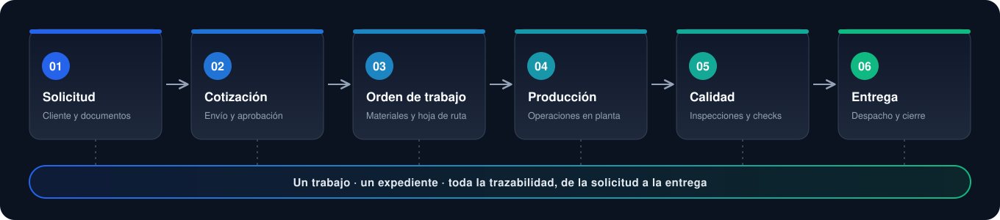
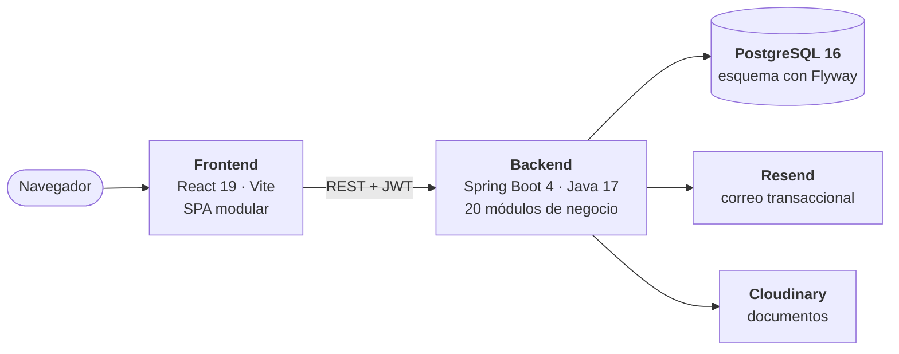
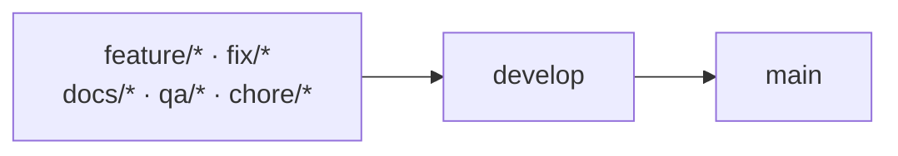

<div align="center">

<picture>
  <source media="(prefers-color-scheme: dark)" srcset="frontend/public/brand/qualitytrack-mark-inverse.svg">
  
</picture>

# QualityTrack

**Cada pieza, cada decisión, cada control: en un solo expediente.**
<br>
La plataforma de trazabilidad para talleres de mecanizado industrial.

<br>

[](https://qualitytrack-frontend.vercel.app/)
[](#-inicio-rápido)
[](#-documentación)

<br>


<br>


</div>

<br>

## ✦ Una idea simple

En un taller que maquina piezas para clientes industriales, un mismo trabajo vive repartido entre correos, hojas de cálculo, planos sueltos y llamadas. Nadie sabe con certeza qué plano está vigente, qué se cotizó, qué material se usó ni qué se midió antes de entregar.

**QualityTrack reemplaza esa dispersión con un expediente único por trabajo**, que acompaña la pieza desde que el cliente la solicita hasta que sale del taller y conserva todo su historial.

<br>

<div align="center">
  
</div>

<br>

## ✦ Dos caras de un mismo proceso

<table>
<tr>
<td width="50%" valign="top">

### 🏢 Portal del cliente

Una empresa registra lo que necesita y ve cómo avanza, sin llamar al taller.

- Crea solicitudes con planos y documentos
- Revisa cotizaciones: aprueba, rechaza o pide ajustes
- Sigue el avance hasta la entrega
- Administra su empresa, miembros y direcciones

</td>
<td width="50%" valign="top">

### 🏭 Operación interna

Cada área trabaja sobre el mismo expediente, con permisos por rol.

- Comercial, ingeniería, producción, calidad y logística
- Materiales, hojas de ruta y operaciones con dependencias
- Inspecciones, no conformidades y retrabajo
- Dashboard, búsqueda global y rol de auditor

</td>
</tr>
</table>

<br>

## ✦ Recorrido por la aplicación

<table>
<tr>
<td width="50%" valign="top">

<br><br>
<b>01 · Solicitud y expediente</b><br>
<sub>El cliente describe la pieza y adjunta su documentación. Desde ese momento nace el expediente que conserva el contexto del trabajo.</sub>
</td>
<td width="50%" valign="top">

<br><br>
<b>02 · Cotización</b><br>
<sub>Comercial prepara la propuesta; el cliente la revisa y decide. Las cotizaciones enviadas expiran solas al vencer su vigencia.</sub>
</td>
</tr>
<tr>
<td width="50%" valign="top">

<br><br>
<b>03 · Orden de trabajo y producción</b><br>
<sub>Una cotización aprobada se convierte en trabajo operativo: materiales, documentos fijados, hoja de ruta y operaciones.</sub>
</td>
<td width="50%" valign="top">

<br><br>
<b>04 · Calidad</b><br>
<sub>Las inspecciones se registran dentro del expediente. Si algo falla, se abre una no conformidad antes de que la pieza avance.</sub>
</td>
</tr>
</table>

<br>

## ✦ Lo que hace diferente a QualityTrack

<table>
<tr>
<td width="33%" valign="top">

#### 🔗 Trazabilidad real
Cada cambio de estado, documento y acción relevante queda en la línea de tiempo del expediente.

</td>
<td width="33%" valign="top">

#### 🛡️ Reglas en el dominio
Una etapa no avanza sin cumplir las precondiciones de la anterior. Solo una cotización aprobada habilita una orden de trabajo.

</td>
<td width="33%" valign="top">

#### 📎 Documentos versionados
Versiones controladas y planos fijados para fabricación. Almacenamiento local o en Cloudinary.

</td>
</tr>
<tr>
<td width="33%" valign="top">

#### ✅ Calidad flexible
Inspecciones con controles genéricos, no solo mediciones numéricas, y gestión de no conformidades con retrabajo.

</td>
<td width="33%" valign="top">

#### 🔐 Acceso seguro
JWT stateless, verificación de correo, recuperación de contraseña e invitaciones para clientes y personal interno.

</td>
<td width="33%" valign="top">

#### 🎯 Demo sin riesgo
Entra como cliente o como equipo interno con un clic. La contraseña demo nunca llega al navegador.

</td>
</tr>
</table>

<br>

## ✦ Tecnología

<div align="center">

| | |
| :--- | :--- |
| **Backend** | Java 17 · Spring Boot 4.1.1 · Spring Security + JWT · Spring Data JPA · MapStruct · SpringDoc OpenAPI |
| **Frontend** | React 19 · TypeScript 6 · Vite 8 · TanStack Query · Zustand · React Hook Form + Zod · Tailwind CSS 4 + DaisyUI 5 |
| **Datos** | PostgreSQL 16 · Flyway (36 migraciones) |
| **Integraciones** | Resend (correo transaccional) · Cloudinary (documentos) |
| **Calidad** | JUnit · Testcontainers · ESLint · Prettier · GitHub Actions |
| **Infraestructura** | Docker multi-stage · Docker Compose · Vercel |

</div>

### Arquitectura



<details>
<summary><b>Módulos del backend</b></summary>

<br>

Monolito organizado por capacidades de negocio bajo `com.nocountry.qualitytrack`:

`auth` · `customers` · `requests` · `quotations` · `workorders` · `materials` · `machines` · `routing` · `production` · `quality` · `nonconformities` · `deliveries` · `documents` · `traceability` · `dashboard` · `search` · `users` · `notification` · `devseed` · `shared`

Flyway es la fuente de verdad del esquema; Hibernate solo lo **valida** (`ddl-auto=validate`).

</details>

<details>
<summary><b>Arquitectura del frontend</b></summary>

<br>

Módulos orientados a dominio con dirección de dependencias estricta:

```text
app  ──▶  modules  ──▶  shared
```

`shared` no importa de `modules` ni de `app`, y los módulos solo se consumen entre sí a través de su `index.ts` público. Las reglas completas están en [`frontend/ARCHITECTURE.md`](frontend/ARCHITECTURE.md) y se verifican con `npm run architecture:check`.

</details>

<details>
<summary><b>Estados, roles y tipos de cuenta</b></summary>

<br>

| Entidad | Estados |
| --- | --- |
| Expediente | `SUBMITTED` → `UNDER_REVIEW` ⇄ `WAITING_CUSTOMER_INFO` · `UNDER_REVIEW` → `READY_FOR_QUOTATION` → `AWAITING_WORK_ORDER` → `IN_PRODUCTION` → `COMPLETED` · `CANCELLED` |
| Cotización | `DRAFT`, `ADJUSTMENT_REQUESTED`, `SENT`, `APPROVED`, `REJECTED`, `SUPERSEDED`, `EXPIRED`, `CANCELLED` |
| Orden de trabajo | `CREATED`, `READY_FOR_PRODUCTION`, `IN_PRODUCTION`, `QUALITY_PENDING`, `QUALITY_HOLD`, `REWORK_IN_PROGRESS`, `READY_FOR_DELIVERY`, `DELIVERED`, `CANCELLED` |
| Inspección | `PENDING`, `IN_PROGRESS`, `APPROVED`, `REJECTED` |
| No conformidad | `OPEN`, `CLOSED` |
| Entrega | `PENDING`, `DISPATCHED`, `DELIVERED`, `CANCELLED` |

**Roles internos:** `ADMIN` · `COMMERCIAL` · `ENGINEERING` · `PRODUCTION` · `QUALITY` · `LOGISTICS` · `AUDITOR`
**Tipos de cuenta:** `CUSTOMER` (entra a `/portal`) e `INTERNAL` (entra a `/dashboard`)

</details>

<br>

## ✦ Inicio rápido

> **Necesitas:** Docker con Compose · Node.js `^20.19.0` o `>=22.13.0` (requisito de Vite 8 y ESLint 10) · Java 17 solo si ejecutas el backend sin Docker.
> El backend incluye Maven Wrapper; no hace falta instalar Maven.

### 1 · Clona el repositorio

```bash
git clone https://github.com/No-Country-simulation/S08-26-Equipo-01.git
cd S08-26-Equipo-01
```

### 2 · Levanta el backend

```bash
cd backend
cp .env.example .env          # PowerShell: Copy-Item .env.example .env
```

Completa en `backend/.env` como mínimo:

| Variable | Qué poner |
| --- | --- |
| `JWT_SECRET` | Secreto en **Base64** de al menos 32 bytes. Genéralo con `openssl rand -base64 32`. |
| `RESEND_APIKEY` | ⚠️ **No puede estar vacío o la app no arranca.** En local sirve un valor de relleno como `re_local_placeholder`; los correos no se enviarán. |
| `APP_BOOTSTRAP_ADMIN_*` | Pon `APP_BOOTSTRAP_ADMIN_ENABLED=true` y completa nombre, apellido, correo y contraseña para crear tu primer administrador. |

```bash
docker compose up --build
```

| Servicio | URL |
| --- | --- |
| API | http://localhost:8085 |
| Swagger UI | http://localhost:8085/swagger-ui.html |
| Health check | http://localhost:8085/actuator/health |
| PostgreSQL (desde el host) | `localhost:5435` |

Flyway aplica las migraciones al iniciar. Para detener: `docker compose down` (con `-v` borras también los datos locales).

<details>
<summary><b>Alternativa: ejecutar el backend con Maven</b></summary>

<br>

Necesitas un PostgreSQL accesible y las variables de `.env` exportadas en tu entorno:

```bash
./mvnw spring-boot:run        # Windows: .\mvnw.cmd spring-boot:run
```

En este modo la API escucha en `http://localhost:8080`.

</details>

### 3 · Levanta el frontend

En otra terminal:

```bash
cd frontend
cp .env.example .env.local    # PowerShell: Copy-Item .env.example .env.local
```

En `frontend/.env.local` apunta a tu backend (`http://localhost:8080/api/v1` si usaste Maven):

```env
VITE_API_URL=http://localhost:8085/api/v1
```

```bash
npm ci
npm run dev
```

Abre **http://localhost:5173**, el origen CORS que el backend permite por defecto.

> 💡 Sin una `RESEND_APIKEY` real no llegan los correos de verificación, así que no podrás completar el registro de cuentas nuevas. Para recorrer la aplicación en local usa el administrador bootstrap, el modo demo o el seed.

<br>

## ✦ Datos y cuentas de demostración

Tres mecanismos independientes. No los confundas:

<table>
<tr>
<td width="33%" valign="top">

#### 🔑 Bootstrap de administrador
Crea el primer `ADMIN` interno al aprovisionar un ambiente. Desactívalo después; apagarlo no elimina al usuario.

<sub>`APP_BOOTSTRAP_ADMIN_*`</sub>

</td>
<td width="33%" valign="top">

#### 🌐 Modo demo público
Habilita los botones *Demo cliente* y *Demo equipo interno* del login mediante `POST /api/v1/auth/demo-login`. La contraseña vive solo en el backend.

<sub>`APP_DEMO_ENABLED` · `APP_DEMO_PASSWORD`</sub>

</td>
<td width="33%" valign="top">

#### 🌱 Seed local determinístico
Reconstruye una base **local** con escenarios que recorren todo el flujo, de un expediente recién recibido a una entrega completada.

<sub>`scripts/dev/reset-and-seed.ps1`</sub>

</td>
</tr>
</table>

El seed no usa un `seed.sql`: avanza cotizaciones, órdenes, producción, calidad y entregas con los mismos servicios de dominio que la aplicación, así que los datos respetan las reglas de negocio reales.

```powershell
# Desde la raíz del repositorio. ELIMINA el schema `public` de la base local.
.\scripts\dev\reset-and-seed.ps1 -ConfirmReset
```

Requiere PostgreSQL local, `psql` en el `PATH`, Java 17 y `backend/.env`. El script se niega a correr contra hosts no locales, bases con nombres tipo producción o bases con otras conexiones abiertas. Cuentas y escenarios incluidos en [`docs/backend/datos-demo-locales.md`](docs/backend/datos-demo-locales.md).

> ⚠️ **Nunca** actives el perfil `seed-demo` contra una base compartida o de producción, y mantén `APP_DEMO_PASSWORD` separada de cualquier contraseña real.

<br>

## ✦ Configuración

La referencia completa y comentada está en [`backend/.env.example`](backend/.env.example) y [`frontend/.env.example`](frontend/.env.example).

| Variable | Descripción | Por defecto |
| --- | --- | --- |
| `DB_HOST` · `DB_PORT` · `DB_NAME` · `DB_USER` · `DB_PASSWORD` | Conexión a PostgreSQL | `DB_PORT=5432`; el resto, obligatorio fuera de Docker Compose |
| `JWT_SECRET` | Secreto Base64 (≥ 32 bytes decodificados) | *obligatorio* |
| `JWT_ACCESS_EXPIRATION` | Vigencia del token de acceso | `15m` |
| `CORS_ALLOWED_ORIGINS` · `FRONTEND_BASE_URL` | Origen del frontend | `http://localhost:5173` |
| `DOCUMENT_STORAGE_PROVIDER` | `local` o `cloudinary` | `local` |
| `DOCUMENT_MAX_FILE_SIZE` · `DOCUMENT_MAX_FILES_PER_REQUEST` | Límites de carga | `25MB` · `5` |
| `RESEND_APIKEY` · `RESEND_EMAIL` | Correo transaccional | *`RESEND_APIKEY` obligatorio, no vacío* |
| `QUOTATION_EXPIRATION_ZONE` · `QUOTATION_EXPIRATION_CRON` | Cuándo expiran las cotizaciones enviadas | ver nota |
| `VITE_API_URL` | URL base de la API (frontend) | `/api/v1` |

> **Sobre la expiración de cotizaciones:** `backend/.env.example` sugiere `America/Mexico_City` con `0 5 0 * * *` (una vez al día), mientras que sin esas variables la aplicación usa `America/Mazatlan` con `0 */5 * * * *` (cada 5 minutos). Defínelas explícitamente según el comportamiento que quieras.

<br>

## ✦ Calidad y pruebas

<table>
<tr>
<td width="50%" valign="top">

#### Backend
64 clases y más de 300 casos de prueba, unitarios e integración.

```bash
cd backend
./mvnw test
./mvnw clean package
```

<sub>Las pruebas de persistencia usan Testcontainers: necesitan Docker en ejecución.</sub>

</td>
<td width="50%" valign="top">

#### Frontend

```bash
cd frontend
npm run check     # arquitectura + tipos + lint + formato
npm run build
```

<sub>Hoy no hay una suite de pruebas automatizadas en el frontend: `check` valida estructura, tipos, lint y formato, no comportamiento.</sub>

</td>
</tr>
</table>

<br>

## ✦ Contribuir

Un workflow de GitHub Actions ([`validate-pr-flow.yml`](.github/workflows/validate-pr-flow.yml)) hace cumplir este camino en cada Pull Request:



- Los PR hacia **`main`** solo pueden venir de **`develop`**.
- Los PR hacia **`develop`** deben venir de ramas con estos nombres:
  - `feature/frontend-<tema>` · `feature/backend-<tema>`
  - `fix/frontend-<tema>` · `fix/backend-<tema>`
  - `docs/<tema>` · `qa/<tema>` · `chore/<tema>`
- Usa la [plantilla de Pull Request](.github/PULL_REQUEST_TEMPLATE.md).
- Para el frontend, lee antes [`CONTRIBUTING.md`](frontend/CONTRIBUTING.md), [`ARCHITECTURE.md`](frontend/ARCHITECTURE.md) y [`AGENTS.md`](frontend/AGENTS.md).
- **Base de datos:** no edites una migración ya aplicada en un ambiente compartido; crea una nueva migración versionada.

<br>

## ✦ Despliegue

<table>
<tr>
<td width="50%" valign="top">

#### Frontend → Vercel
`frontend/vercel.json` reescribe todas las rutas a `index.html` para que React Router resuelva rutas profundas como `/job-cases/123` al recargar. Configura `VITE_API_URL=https://<tu-backend>/api/v1`.

</td>
<td width="50%" valign="top">

#### Backend → contenedor Docker
Imagen multi-stage (Maven + Java 17 → Temurin 17 JRE) con usuario sin privilegios, expuesta en el puerto `8080`.

```bash
cd backend
docker build -t qualitytrack-backend .
docker run --env-file .env -p 8080:8080 qualitytrack-backend
```

</td>
</tr>
</table>

**Antes de salir a producción:** PostgreSQL administrado · `DOCUMENT_STORAGE_PROVIDER=cloudinary` con `CLOUDINARY_URL` · secretos solo por variables de entorno · `CORS_ALLOWED_ORIGINS` limitado al dominio real · `APP_BOOTSTRAP_ADMIN_ENABLED=false` tras crear el primer administrador · `APP_DEMO_PASSWORD` independiente de credenciales reales · HTTPS de punta a punta.

<br>

## ✦ Estructura del repositorio

```text
.
├── backend/                 API REST (Spring Boot)
│   ├── src/main/java/com/nocountry/qualitytrack/   módulos de negocio
│   ├── src/main/resources/db/migration/            migraciones Flyway
│   └── compose.yaml · Dockerfile · .env.example
├── frontend/                SPA (React + Vite)
│   ├── src/app/             layout, providers, router
│   ├── src/modules/         módulos por dominio
│   └── src/shared/          api, componentes, config, utilidades
├── docs/                    documentación técnica y recursos del README
├── scripts/dev/             reset-and-seed.ps1
└── .github/                 workflow de PR y plantilla
```

<br>

## ✦ Documentación

<table>
<tr>
<td width="33%" align="center" valign="top">

**Backend**<br>
<sub>Configuración, seguridad, migraciones y despliegue</sub><br><br>
[**Leer →**](backend/README.md)

</td>
<td width="33%" align="center" valign="top">

**Frontend**<br>
<sub>Módulos, estado, rutas y responsive</sub><br><br>
[**Leer →**](frontend/README.md)

</td>
<td width="33%" align="center" valign="top">

**Datos demo**<br>
<sub>Seed local, cuentas y escenarios</sub><br><br>
[**Leer →**](docs/backend/datos-demo-locales.md)

</td>
</tr>
</table>

<br>

---

<div align="center">

<sub>QualityTrack se desarrolla como plataforma de simulación industrial dentro del programa <b>No Country</b> · cohorte <code>S08-26</code> · equipo <code>01</code></sub>

</div>
